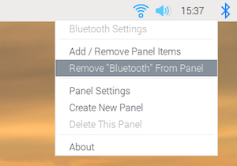
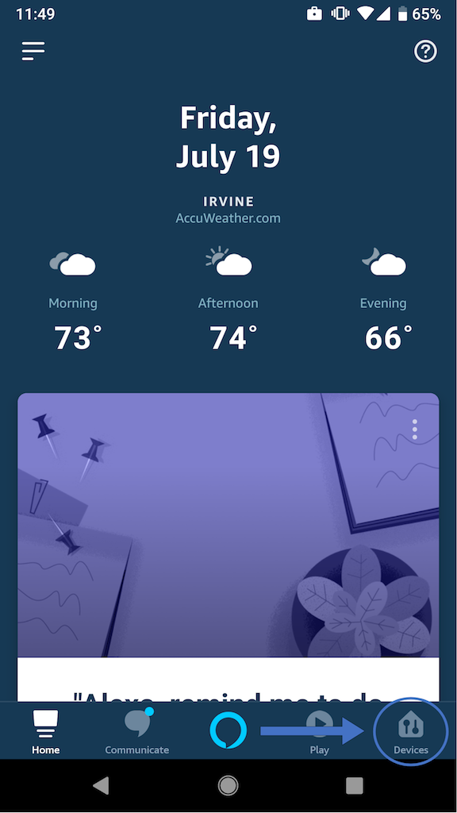
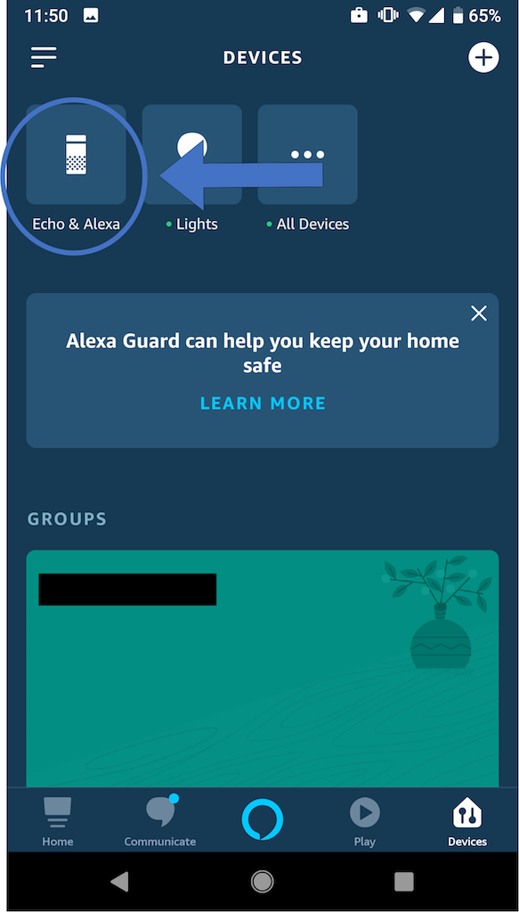
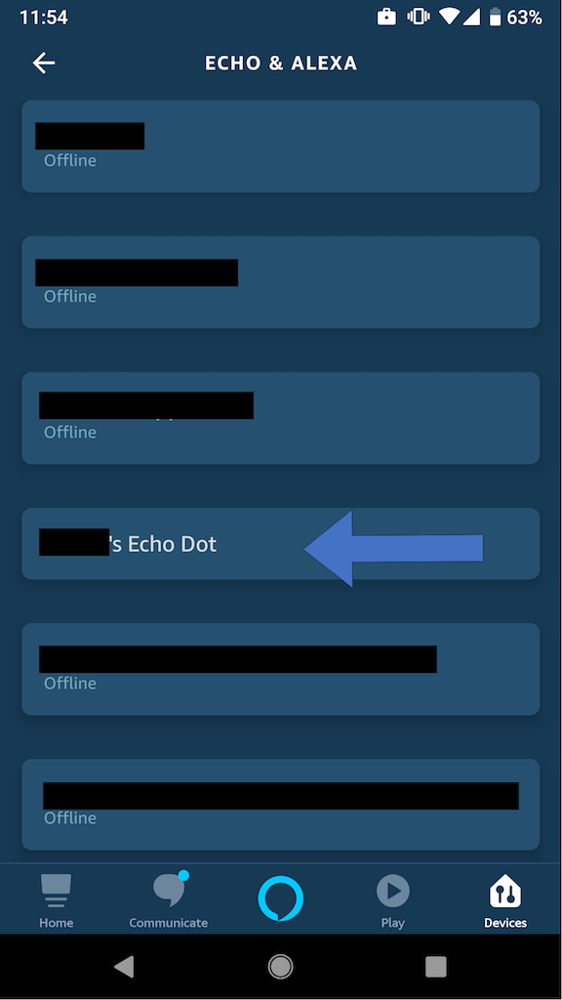
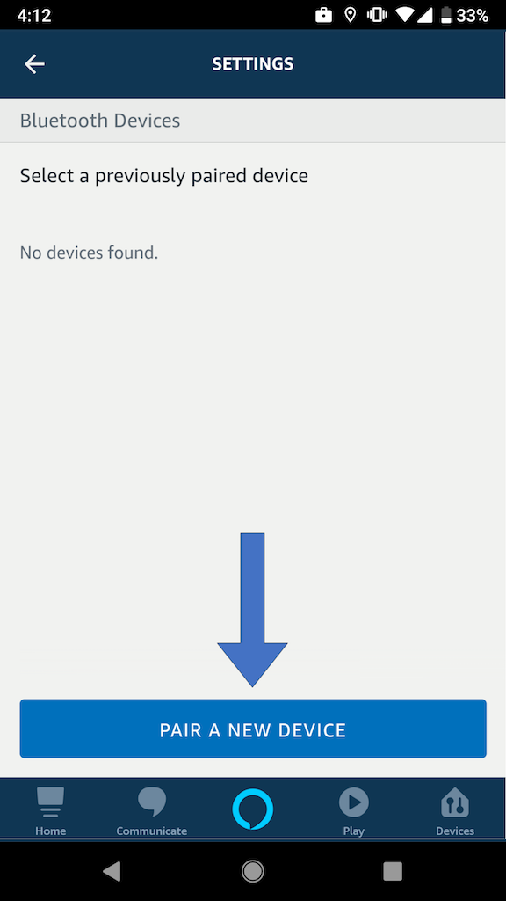
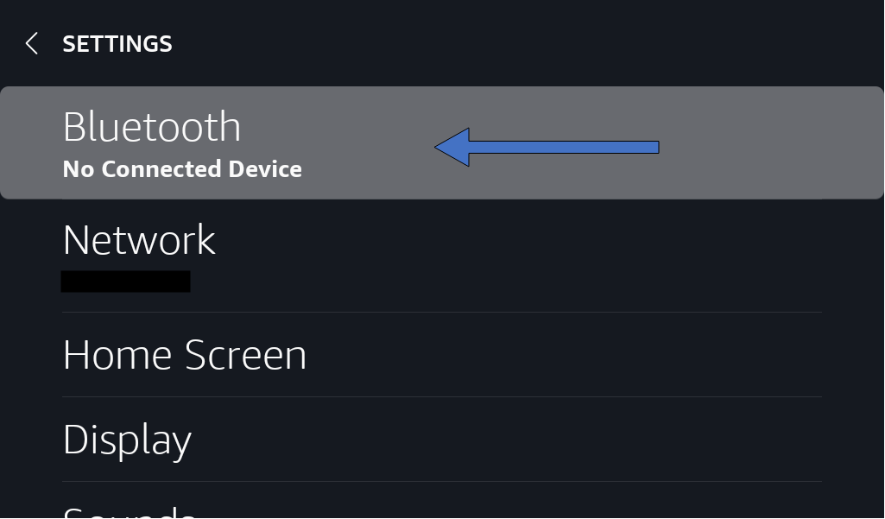
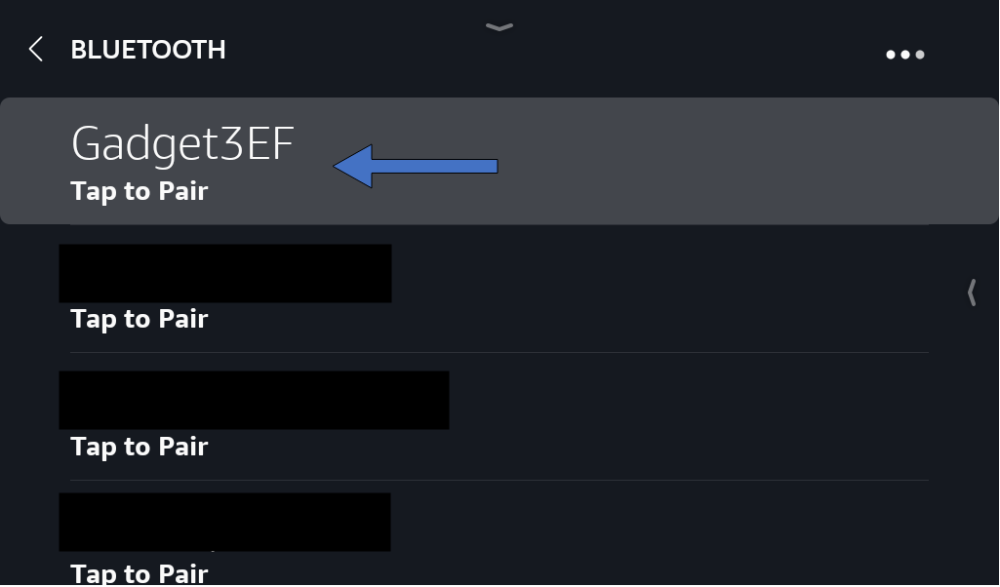
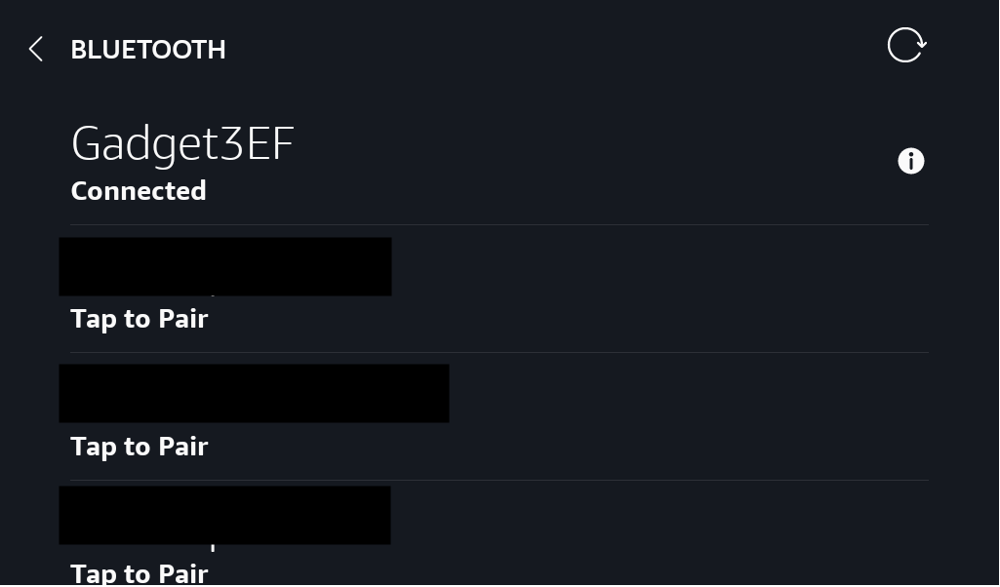
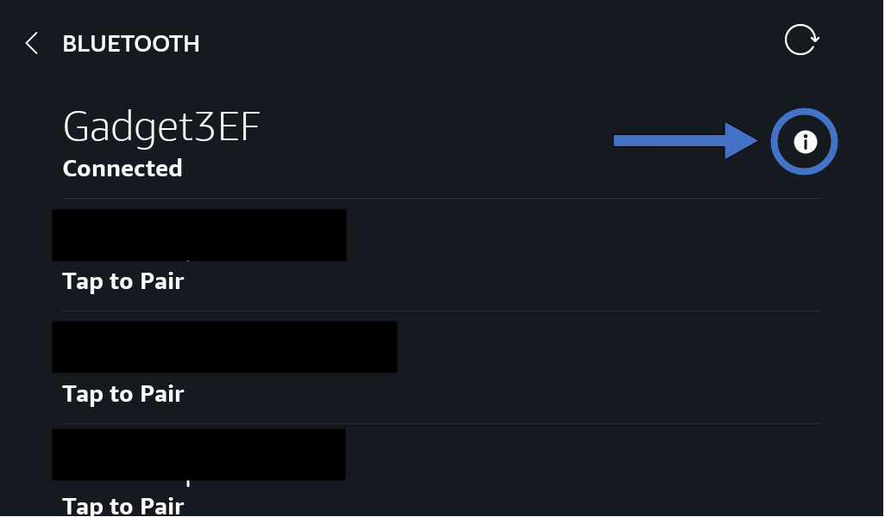
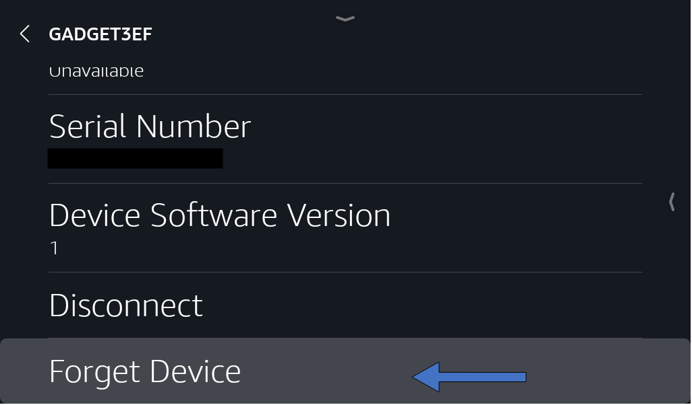

# Alexa Gadgets Raspberry Pi Samples

Quickly create an Alexa Gadget using a Raspberry Pi, Python, and the [Alexa Gadgets Toolkit](https://developer.amazon.com/alexa/alexa-gadgets).

- [Prerequisites](#prerequisites)
- [Installation](#installation)
- [Registering a gadget in the AVS Developer Console](#registering-a-gadget-in-the-alexa-voice-service-developer-console)
- [Projects](#projects)
- [How does this work?](#how-does-this-work)
- [Pairing your gadget to an Echo Device](#pairing-your-gadget-to-an-echo-device)

## Prerequisites

- Raspberry Pi Zero W ([Starter Kit](https://www.amazon.com/CanaKit-Raspberry-Wireless-Complete-Starter/dp/B072N3X39J/)) or Raspberry Pi 3 B+ ([Starter Kit](https://www.amazon.com/CanaKit-Raspberry-Complete-Starter-Premium/dp/B07BLRSKBV)) with an internet connection
- A [Micro SD card](https://www.amazon.com/SanDisk-Mobile-MicroSDHC-SDSDQM-B35A-Adapter/dp/B004ZIENBA/) with a minimum of 8GB of space and the latest version of [Raspian Stretch](https://www.raspberrypi.org/downloads/raspbian/) installed.
- An [Amazon Developer account](https://developer.amazon.com/alexa). If you don't already have a developer account, create one.
- An Echo device that is compatible with Alexa Gadgets. [Learn more](https://developer.amazon.com/docs/alexa-gadgets-toolkit/understand-alexa-gadgets-toolkit.html#devices)

If you need help getting your Raspberry Pi set up, there are a number of guides available online with instructions; you may want to [follow this one](https://hackernoon.com/raspberry-pi-headless-install-462ccabd75d0). Make sure your Raspberry Pi is up-to-date with the latest updates.

> **Note:** The examples require header pins, but you do not need to add them now. You can [solder them on](https://www.adafruit.com/product/3907) later or order a board that [already has them](https://www.adafruit.com/product/3708)

## Registering a gadget in the Alexa Voice Service Developer Console

To create a gadget that works with your Echo device, you first need to register a new gadget in the [Alexa Voice Service Developer Console](https://developer.amazon.com/avs/home.html#/avs/home).

1. Sign in to the [Alexa Voice Service Developer Console](https://developer.amazon.com/avs/home.html#/avs/home). If you don't already have a developer account, create one.

    

2. If you haven't registered an AVS product in the past, click **GET STARTED**.

    

3. Click **PRODUCTS**, and then click **CREATE PRODUCT**.

    

4. Fill out the requested information, select **Alexa Gadget** as the product type, and then click **FINISH**.

    

5. In the pop-up, click **OK**.
6. You will be taken to a list of your products. Click on the gadget you just created.

    

7. At the top, you'll see an **Amazon ID** and **Alexa Gadget Secret**. You'll need these for the following steps to create your Alexa Gadget. Keep this ID and Secret private because they uniquely identify your gadget.

    

To learn more, refer to [Register a Gadget](https://developer.amazon.com/docs/alexa-gadgets-toolkit/register-gadget.html) in the Alexa Gadgets Toolkit documentation.

## Installation

In order to get your Raspberry Pi set up as an Alexa Gadget, you will need to download and install some Python packages. To run the following commands, you will need to be connected to your Pi via SSH or VNC, or be running them directly using a keyboard, mouse, and monitor connected to your Pi. Make sure your Pi is connected to the internet.

Download Alexa-Gadgets-Raspberry-Pi-Samples repo from GitHub using one of the following ways:

* **Using git clone:**
    - In your terminal:
        ```
        git clone https://github.com/alexa/Alexa-Gadgets-Raspberry-Pi-Samples.git
        ```
    - If you didn't clone the repo directly on your Pi, you can transfer it to your Pi using the `scp` [command](https://www.raspberrypi.org/documentation/remote-access/ssh/scp.md)
        ```
        scp -r Alexa-Gadgets-Raspberry-Pi-Samples pi@192.168.0.1:~/Alexa-Gadgets-Raspberry-Pi-Samples
        ```
    **Note:** Replace `192.168.0.1` with the IP address of your Pi.
* **Using GitHub Web UI:**
    - Click on the **Clone or download** button and click on **Download ZIP**.
    - Unzip the downloaded `Alexa-Gadgets-Raspberry-Pi-Samples-master.zip` file:
        ```
        unzip Alexa-Gadgets-Raspberry-Pi-Samples-master.zip
        ```
    - If you didn't download & unzip the repo directly on your Pi, you can transfer it to your Pi using the `scp` [command](https://www.raspberrypi.org/documentation/remote-access/ssh/scp.md)
        ```
        scp -r Alexa-Gadgets-Raspberry-Pi-Samples-master pi@192.168.0.1:~/Alexa-Gadgets-Raspberry-Pi-Samples
        ```

    **Note:** Replace `192.168.0.1` with the IP address of your Pi.

Once you have the `Alexa-Gadgets-Raspberry-Pi-Samples` repo on your Pi, go into the `Alexa-Gadgets-Raspberry-Pi-Samples` folder

```
cd /home/pi/Alexa-Gadgets-Raspberry-Pi-Samples/
```

Run the setup script, which will update your Pi (this could take around 15 - 20 minutes, depending on your Internet connection speed), and install libraries for Bluetooth, protobuf, interacting with GPIOs, etc.

```
sudo bash ./setup.sh
```

> **Note:** Since the gadget needs a reliable Bluetooth connection with the Echo device, the A2DP Bluetooth profile will be disabled as part of the setup. If you would like to re-enable it please follow the Troubleshooting guide below.

If you already have registered your gadget using the **Registering a gadget in the Alexa Voice Service Developer Console** section, you can press `y` and enter your gadget's `Amazon ID` and `Alexa Gadget Secret` so that the setup script automatically configures all the examples with your gadget's credentials.


Once the script completes, press any button to reboot your Pi.

> If you're using Pi in Desktop mode (using Pi with a display), you should disable the Pi Bluetooth menu to prevent two bluetooth clients (your gadget script and the Pi Bluetooth client) handling the bluetooth connections at the same time (which might lead to connectivity issues).
To disable the Pi Bluetooth menu right click on bluetooth icon on the top right of your screen, select *Remove "Bluetooth" From Panel* and reboot your Pi.
    

## Projects

The best way to get familiar with creating your own gadget, is to reference the example projects that are a part of this project.

You can find example projects in the `/home/pi/Alexa-Gadgets-Raspberry-Pi-Samples/src/examples` folder. The Kitchen Sink example is a great place to start.

Projects include:

- [Kitchen Sink Gadget](src/examples/kitchensink/): Create an Alexa Gadget that prints messages in response to directives from [Alexa Gadgets Toolkit interfaces](https://developer.amazon.com/docs/alexa-gadgets-toolkit/supported-interfaces.html), including wake word detection, alarms, timers, notifications, and reminders.
- [Color Cycler Gadget](src/examples/colorcycler/): Create an Alexa Gadget with an LED and a button, that uses Custom Directives to cycle through different colors and uses Custom Events to report the LED color when the button is pressed. This project requires an Alexa skill.
- [Wake Word Gadget](src/examples/wakeword/): Create an Alexa Gadget that turns an LED on and off in sync with the detection of the wake word.
- [Notification Flag Gadget](src/examples/notification/): Create an Alexa Gadget that rotates a servo to raise and lower a flag when a notification is received or cleared on a paired Echo device.
- [Timer Gadget](src/examples/timer/): Create an Alexa Gadget that reacts to a single timer set on an Echo device. A servo rotates a disc to indicate the remaining duration of the timer, when the timer expires, and when a timer is canceled.

## How does this work?

This Python software enables the creation of an Alexa Gadget by handling the Bluetooth connection of the gadget to an Echo device, and responding to messages based on the Alexa Gadget Toolkit capabilities you specify.

### Configuration

Each gadget you create, including the examples, requires a configuration file that specifies the `Amazon ID` and `Alexa Gadget Secret` you created in the [Alexa Voice Service Developer Console]("https://developer.amazon.com/avs/home.html#/avs/home"), as well as a specification of the capabilities of your gadget.

In each example, there is a `.ini` file that includes this information. For example, the Kitchen Sink gadget's configuration looks like:

```
[GadgetSettings]
amazonId = YOUR_GADGET_AMAZON_ID
alexaGadgetSecret = YOUR_GADGET_SECRET

[GadgetCapabilities]
Alexa.Gadget.StateListener = 1.0 - timeinfo, timers, alarms, reminders, wakeword
Alerts = 1.1
Notifications = 1.0
Alexa.Gadget.MusicData = 1.0 - tempo
Alexa.Gadget.SpeechData = 1.0 - viseme
```

The Kitchen Sink example responds to all the Alexa Gadget Toolkit capabilities that are available, which you can see listed. You can learn more about these capabilities in the [Alexa Gadgets Toolkit documentation](https://developer.amazon.com/docs/alexa-gadgets-toolkit/features.html).

The configuration file should either be:
- placed in the same folder as the python script and should have the same name as the python script;
for e.g. for the Kitchen Sink example, the name of the configuration file should be same (`kitchen_sink_gadget.ini`) as the name of the python script (`kitchen_sink_gadget.py`) and both should be placed in the same folder (`Alexa-Gadgets-Raspberry-Pi-Samples/src/examples/kitchensink`).
- Or, the path to the configuration `.ini` file should be defined in your python script as follows:
```python
class KitchenSinkGadget(AlexaGadget):
    def __init__(self):
        super().__init__(gadget_config_path='path/to/config.ini')
        ...
```

> **Note:** You do not need to create new credentials for each new gadget you create, especially if you're just experimenting. As you refine your prototype, you may want to make sure that gadget has its own Amazon ID and Alexa Gadget Secret to avoid conflicts with other gadgets you create.

### Callbacks

Each example project leverages callbacks that have been provided for responding to the capabilities that your gadget is configured to respond to.

You can see an example of these callbacks in the Kitchen Sink gadget within the `Alexa-Gadgets-Raspberry-Pi-Samples/src/examples/kitchensink/kitchen_sink_gadget.py` Python file, including:

* `on_connected()`
* `on_disconnected()`
* `on_alexa_gadget_statelistener_stateupdate()`
* `on_alerts_setalert()`
* `on_alerts_deletealert()`
* `on_notifications_setindicator()`
* `on_notifications_clearindicator()`
* `on_alexa_gadget_speechdata_speechmarks()`
* `on_alexa_gadget_musicdata_tempo()`

The following is more detail on each of these callbacks:

#### on_connected()

The gadget has connected to the paired Echo device.

#### on_disconnected()
The gadget has disconnected to the paired Echo device.

#### on_alexa_gadget_statelistener_stateupdate()

`Alexa.Gadget.StateListener.StateUpdate` directive received, including alarms, timers, reminders, wakeword, and timeinfo. To learn more, refer to the [Alexa.Gadget.StateListener Interface](https://developer.amazon.com/docs/alexa-gadgets-toolkit/alexa-gadget-statelistener-interface.html#StateUpdate-directive) documentation.

`Alexa.Gadget.StateListener = 1.0 - timeinfo, timers, alarms, reminders, wakeword` for each must be specified in the `[Gadget Capabilities]` section of your gadget's configuration file. You can remove unused types.

Directives for `StateListener` look like this:

```
# Time info
{ {'payload': {'states': [{'value': '2019-03-25T14:43:10-07:00', 'name': 'timeinfo'}]}, 'header': {'namespace': 'Alexa.Gadget.StateListener', 'name': 'StateUpdate'}} }

# Wake word active
{ {'payload': {'states': [{'value': 'active', 'name': 'wakeword'}]}, 'header': {'namespace': 'Alexa.Gadget.StateListener', 'name': 'StateUpdate'}} }

# Wake word cleared
{ {'payload': {'states': [{'value': 'cleared', 'name': 'wakeword'}]}, 'header': {'namespace': 'Alexa.Gadget.StateListener', 'name': 'StateUpdate'}} }

# Timer active
{ {'payload': {'states': [{'value': 'active', 'name': 'timers'}]}, 'header': {'namespace': 'Alexa.Gadget.StateListener', 'name': 'StateUpdate'}} }

# Timer cleared
{ {'payload': {'states': [{'value': 'cleared', 'name': 'timers'}]}, 'header': {'namespace': 'Alexa.Gadget.StateListener', 'name': 'StateUpdate'}} }
```

#### on_alerts_setalert()

`Alerts` `SetAlert` directive received, for alarms, timers, and reminders. To learn more, refer to the [Alerts Interface](https://developer.amazon.com/docs/alexa-gadgets-toolkit/alerts-interface.html) documentation.

`Alerts = 1.1` must be specified in the `[Gadget Capabilities]` section of your gadget's configuration file. 

Directives for `Alerts` `SetAlert` look like this:

```
# Alert set
{ {'payload': {'type': 'TIMER', 'token': '853514641', 'scheduledTime': '2019-03-25T14:44:51-07:00'}, 'header': {'namespace': 'Alerts', 'name': 'SetAlert'}} }
```

#### on_alerts_deletealert()

`Alerts` `DeleteAlert` directive received, for alarms, timers, and reminders. To learn more, refer to the [Alerts Interface](https://developer.amazon.com/docs/alexa-gadgets-toolkit/alerts-interface.html)  documentation.

`Alerts = 1.1` must be specified in the `[Gadget Capabilities]` section of your gadget's configuration file. 

Directives for `Alerts` `DeleteAlert` look like this:

```
# Alert deleted
{ {'payload': {'token': '853514641'}, 'header': {'namespace': 'Alerts', 'name': 'DeleteAlert'}} }
```

#### on_notifications_setindicator()

`Notifications` `SetIndicator` directive received for notifications. To learn more, refer to the [Notifications Interface](https://developer.amazon.com/docs/alexa-gadgets-toolkit/notifications-interface.html) documentation.

`Notifications = 1.0` must be specified in the `[Gadget Capabilities]` section of your gadget's configuration file.

Directives for `Notification` `SetIndicator` look like this:

```
# Notification set
{ {'payload': {'playAudioIndicator': True, 'asset': {}, 'persistVisualIndicator': True}, 'header': {'namespace': 'Notifications', 'name': 'SetIndicator'}} }
```

#### on_notifications_clearindicator()

`Notifications` `ClearIndicator` directive received for notifications. To learn more, refer to the [Notifications Interface](https://developer.amazon.com/docs/alexa-gadgets-toolkit/notifications-interface.html) documentation.

`Notifications = 1.0` must be specified in the `[Gadget Capabilities]` section of your gadget's configuration file.

Directives for `Notification` `ClearIndicator` look like this:

```
# Notification cleared
{ {'payload': {}, 'header': {'namespace': 'Notifications', 'name': 'ClearIndicator'}} }
```

#### on_alexa_gadget_speechdata_speechmarks()

`SpeechData` `Speechmarks` directive received with speechmark data. To learn more, refer to the [SpeechData Interface](https://developer.amazon.com/docs/alexa-gadgets-toolkit/alexa-gadget-speechdata-interface.html) documentation.

`Alexa.Gadget.SpeechData = 1.0 - viseme` must be specified in the `[Gadget Capabilities]` section of your gadget's configuration file.

Directives for `SpeechData` `Speechmarks` look like this:

```
# Speechmark
{ {'payload': {'speechmarksData': [{'value': 't', 'type': 'VISEME', 'startOffsetInMilliSeconds': 708}]}, 'header': {'namespace': 'Alexa.Gadget.SpeechData', 'name': 'Speechmarks'}} }
```

#### on_alexa_gadget_musicdata_tempo()

`MusicData` `Tempo` directive received with tempo data. To learn more, refer to the [MusicData Interface](https://developer.amazon.com/docs/alexa-gadgets-toolkit/alexa-gadget-musicdata-interface.html) documentation.

`Alexa.Gadget.MusicData = 1.0 - tempo` must be specified in the `[Gadget Capabilities]` section of your gadget's configuration file.

Directives for `MusicData` `Tempo` look like this:

```
# Tempo
{ {'payload': {'playerOffsetInMilliSeconds': 681, 'tempoData': [{'value': 118}]}, 'header': {'namespace': 'Alexa.Gadget.MusicData', 'name': 'Tempo'}} }
```

Using these callbacks you can define how your gadget should respond to the directives sent by the paired Echo device, like lighting an LED, moving a servo, etc.

### Custom Callbacks

In addition to the above callbacks, you can define custom callbacks that respond to the receipt of [custom directives](https://developer.amazon.com/docs/alexa-gadgets-toolkit/custom-interface.html#overview) on the gadget. The name of the callback function is defined by the namespace and name of the custom directive as follows:
The format of the callback name: on_custom_*`namespace`*_*`name`*
**Note:** The *`namespace`* mentioned in the callback name should be without the `Custom.` prefix.

For e.g. in the Color Cycler gadget within the `Alexa-Gadgets-Raspberry-Pi-Samples/src/examples/colorcycler/color_cycler.py` Python file, we have two callbacks for custom directives defined:
```python
def on_custom_colorcyclergadget_blinkled(self, directive):
    ...

def on_custom_colorcyclergadget_stopled(self, directive):
    ...
```
These callbacks correspond to the custom directives under the `Custom.ColorCyclerGadget` namespace, with names `BlinkLED` and `StopLED` respectively.

## Pairing your gadget to an Echo device

In order for a gadget you create to function, it will need to be paired to a [compatible Echo device](https://developer.amazon.com/docs/alexa-gadgets-toolkit/understand-alexa-gadgets-toolkit.html#devices). When running any example, make sure that the Echo device you want to pair to is nearby, and you have access to the Alexa app. The Echo devices that support gadgets are listed in the [Alexa Gadgets Toolkit documentation](https://developer.amazon.com/docs/alexa-gadgets-toolkit/understand-alexa-gadgets-toolkit.html#devices).

If your gadget has never been paired before, it will go into pairing mode when you run your gadget's Python code. Following are the steps to pair your gadget using the Kitchen Sink example:
- On your Pi, navigate to the `kitchensink` example in `Alexa-Gadgets-Raspberry-Pi-Samples/src/examples/kitchensink`.
- Run the kitchen sink example: `python3 kitchen_sink_gadget.py`

    

When in pairing mode, you will see a note of your gadget's friendly name (e.g. **GadgetXYZ**) printed to the console. This name is what to look for when going through the following steps to pair your gadget to your Echo device.

### If you're using an Echo device without a screen

- In the Alexa app, navigate to your devices by tapping the **Devices** icon on the bottom right.

    

- Then tap **Echo & Alexa**.

    

- Then select your Echo device.

    

- In the settings of the Echo device, tap on the **Bluetooth Devices** option.

    

- Tap on **Pair a new Device**.

    

- Scroll through the list of devices to find the friendly name of your gadget. Be patient for it to show up.
- When the gadget's name shows up, tap on the name to initiate pairing.

    

- When your gadget is paired, you should see a new screen with a blue Bluetooth icon next to your gadget's name.
- In the command line, you should also see messages indicating that your gadget is paired.

    


### If you are using an Echo device with a screen

- Swipe down from the top of the screen, tap **Settings**.

    

- Then tap **Bluetooth**.

    

- You should see the friendly name of your gadget appear. Be patient for it to show up.
- When the gadget's name shows up, tap on the name to initiate pairing.

    

- When your gadget is paired, you should be able to see a *connected* message under your gadget's name.

    

- In the command line, you should also see messages indicating that your gadget is paired.

    

> If you face issues pairing or connecting your gadget with the Echo device, please follow the Troubleshooting guide below.

When your gadget connects to an Echo device, you will see a discovery response with information including the capabilities your gadget has registered to use.

You can also pair your gadget using the web version of the Alexa app at [alexa.amazon.com](http://alexa.amazon.com/).

> **Note:** If you're in Desktop mode on your Pi, and if you haven't disabled the Pi Bluetooth menu; while pairing your Pi with the Echo device, you might get a pop-up on your Pi that asks you to trust the device that's trying to connect. You can press OK or ignore the pop up by moving it aside.
If you press OK you might see the following error:
    
    This error is generated by the Pi Bluetooth menu as the A2DP Bluetooth profile is disabled to ensure stable connectivity with the Echo device. The gadget will pair successfully even if you see this error, so you can press OK or ignore the pop up by moving it aside. We strongly recommend disabling the Pi Bluetooth menu by following the instructions at the bottom of the **Installation** section, to ensure that only your gadget script handles the Bluetooth connection with your Echo device.

### Re-pairing your gadget

To re-pair your gadget with the same or different Echo device, you can put your gadget in pairing mode again by adding the `--pair` argument to the command to run the Python code. For example: `python3 kitchen_sink_gadget.py --pair`.

If you are pairing to a previously paired Echo device, please ensure that you first forget the gadget from the Echo device using the instructions in the **Forgetting your gadget from Echo device** section.

### Unpairing your gadget

When you pair your Pi to an Echo device, the Bluetooth address for the Echo device is stored in a JSON file named `.agt.json` at `/src/`. You can manually clear this Bluetooth address as well as the Bluetooth bond with the Echo device by adding a `--clear` argument to the command to run the Python code. For example: `python3 kitchen_sink_gadget.py --clear`.

For good measure, you may want to unpair the gadget from your Echo device using the steps listed below.

### Forgetting your gadget from Echo device
#### If you're using an Echo device without a screen
- In the Alexa app, navigate to your devices by tapping the **Devices** icon on the bottom right. Then tap **Echo & Alexa**, and select your Echo device.
- In the settings of the Echo device, tap on the **Bluetooth Devices**.

    

- Then tap on the drop-down arrow on the right side of the gadget you want unpair, and then tap on **Forget Device**.

    

#### If you are using an Echo device with a screen

- Swipe down from the top of the screen, tap **Settings**, and then tap **Bluetooth**.
- You should see the friendly name of your gadget, tap on the information symbol next to your gadget.

    

- Then tap on **Forget Device**.

    

### Troubleshooting guide
* If your gadget pairs, but fails to connect, stop the Python script by pressing `CTRL + C`, and run it again:
`python3 kitchen_sink_gadget.py`.
* If your gadget fails to pair or needs to re-paired:
    * Forget your gadget from the Echo device using the above **Forgetting your gadget from Echo device** instructions.
    * On the gadget, stop the Python script (if it is running) by pressing `CTRL + C`, and run it again with the clear flag to put it in the pairing mode using the `--pair` argument:
    `python3 kitchen_sink_gadget.py --pair`
    * Follow the instructions in **Pairing your gadget to an Echo device** to pair your gadget again to the Echo device.
* If you see the following error after running `python3 kitchen_sink_gadget.py`
    ```
    Traceback (most recent call last):
    File "kitchen_sink_gadget.py", line 114, in <module>
        KitchenSinkGadget().main()
    File "/home/pi/Alexa-Gadgets-Raspberry-Pi-Samples/src/agt/alexa_gadget.py", line 162, in main
        self.start()
    File "/home/pi/Alexa-Gadgets-Raspberry-Pi-Samples/src/agt/alexa_gadget.py", line 184, in start
        self._bluetooth.start_server()
    File "/home/pi/Alexa-Gadgets-Raspberry-Pi-Samples/src/agt/bluetooth.py", line 108, in start_server
        self._spp_server.start()
    File "/home/pi/Alexa-Gadgets-Raspberry-Pi-Samples/src/agt/bluetooth.py", line 238, in start
        self._server.bind(('', self._channel))
    File "/usr/local/lib/python3.7/dist-packages/bluetooth/bluez.py", line 178, in bind
        return self._sock.bind (addrport)
    _bluetooth.error: (98, 'Address already in use')
    ```
    this might be caused as a result of a stale python process still running in the background. You can kill it using the following command:
    `sudo kill -9 $(ps aux | grep '[p]ython' | awk '{print $2}')`

* As part of the setup script, the A2DP Bluetooth profile is disabled. If you would like to re-enable it, execute the following commands in the terminal:
    ```
    sudo apt-get -y install bluealsa
    sudo reboot
    ```
    >**Note:** We strongly recommend that the A2DP Bluetooth profile is disabled to ensure stable gadget connectivity with the Echo device. To disable it again run the setup script mentioned in the **Installation** section.
